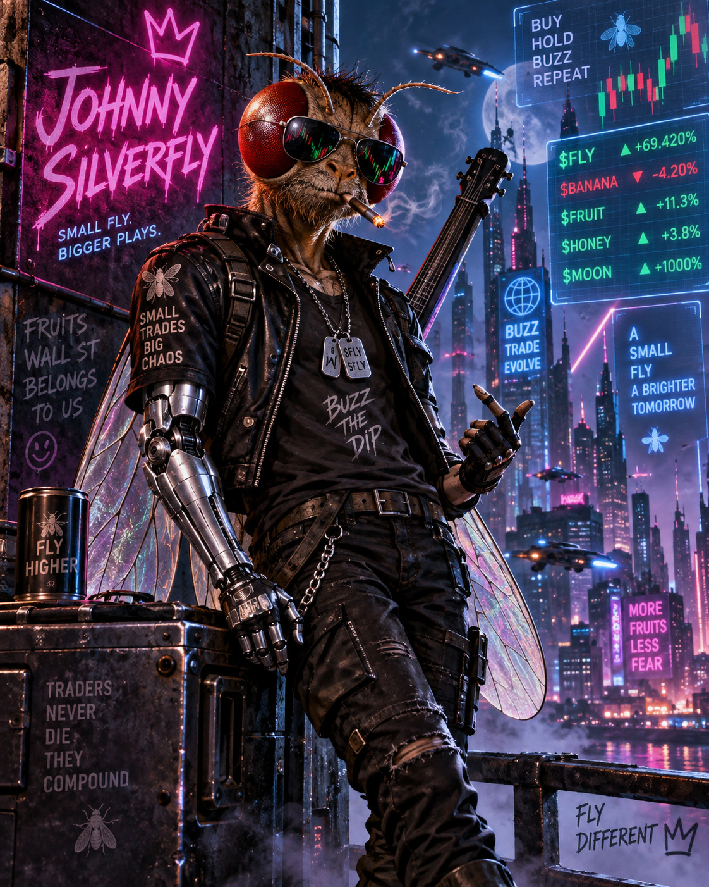

<p align="center">
  
</p>

# Johnny Silverfly

*Son of Stonkfly.*

A fly-connectome simulation that can operate a crypto trading account. Actual neural output, actual Coinbase integration, and a CUDA port of the spiking kernel that evolves a whole herd of flies on one GPU. Profitable learning has not been demonstrated. Every ticker on that billboard is invented; what the flies actually returned is [below](#what-the-measurements-say).

**How it works:** Nine descriptors of public market prices — five read off the closing price alone (fast trend, slow trend, volatility, position in range, acceleration), three read off the whole bar (taker order flow, its fast average, where the bar closed in its own range), and an efference copy of the fly's own last filled trade — are placed as a population code on 53 glomeruli across 2,635 olfactory receptor neurons in the retained **MaleCNS v1.0 graph: 166,700 neurons, 25.6 million connections**. They reach 3,829 of the 4,064 Kenyon cells in two synapses. The whole-bar three need klines and rest without them, so a run on Coinbase closes smells six. Account equity reaches 23 LB3c sugar gustatory cells. A fixed neural readout proposes buy, sell or hold, and a custom **Coinbase AgentKit ActionProvider** checks limits and places spot orders through Coinbase Advanced.

The prices are also drawn as a chart and fed to 3,335 brightness and 811 R8 colour receptors, which is how this started. **That pathway has no operating point.** At the shipped inhibitory ratio the chart reaches the mushroom body with two cells; across the whole range of ratios it drives either a third of the Kenyon population or exactly two of it, never anything between. What looked like visual input was saturation, and the olfactory channel exists because of that measurement.

Positive portfolio P&L stimulates 15 identified PAM11 dopamine cells; negative P&L stimulates two PPL101 aversive dopamine cells. A candidate memory rule changes existing KC-to-MBON connections; with no reinforcement it changes none. These are engineered reinforcement signals, **not modeled pain receptors**. Synaptic changes do not establish that it learns to trade profitably. [Model and evidence](docs/model.md).

## What the measurements say

Every number here comes from a read-only probe, including the ones that cancelled planned work: `tools/diagnose.py` for what the network does, `tools/ic.py` and `tools/features.py` for whether there is a signal to find in the first place. Full write-ups in [validation](docs/validation.md), except for the last three below, which are so far only in the tools that measured them.

- **The network was saturated, and one ratio explained it.** Excitation and inhibition were both set from contact count, so 94% of the layer one synapse from the olfactory receptors fired for every market state. Scaling inhibitory weights by **1.9** holds Kenyon activity at 1.6–2.4%, the range a real mushroom body works in. It was selected on sparseness by a rule declared before the sweep, never on returns.
- **A rally and a crash reached the retina as 98.5% the same image.** Ten of twenty-eight market-state pairs produced a byte-identical Kenyon code. Drawing the price history as a filled area removed all ten collisions, and the fill still ships — but this was the first sign that the visual pathway was saturated rather than informative, which the ratio sweep later confirmed from the other side.
- **Reinforcement responds to timing, not just dose.** Over 60 observations no plastic edge moves without external reinforcement, and scrambling the order of the same reward labels changes the resulting memory more than removing them does.
- **The readout is noise-limited, and widening it does not fix that.** Silencing a random 1% of the network flips the decision four times in five. Three candidate readouts, up to 2,119 cells, all score signal-to-noise below 1 — the market moves them less than silencing unrelated neurons does. So **no decoder change ships**; the bottleneck is upstream.
- **The fly predicts nothing, and neither does what it is fed.** `tools/ic.py` scores a proposal against the forward return with the window's own drift demeaned away, so a fly that merely rides a rising market scores exactly zero: neither the proposals nor the continuous readout behind them carry information about where price goes next, on train or on validation. `tools/features.py` then puts the same question to the five close-derived descriptors before any neuron sees them, and finds nothing at any horizon on 10,446 hourly bars. Of the two diagnoses that leaves — the brain destroys a signal, or there was never one in the input — the second is the one measured.
- **On Coinbase the trade was arithmetically unwinnable.** A round trip pays 130 basis points: 0.6% in fees and 0.05% of spread a side. The information coefficient needed merely to break even on hourly bars at that price is **1.08**, which is larger than perfect foresight. Binance spot charges 10 basis points a side, 20 for the round trip, which moves break-even into a range real signals occupy — so `tools/fetch_binance.py` fetches klines there to measure against. Execution is unchanged: orders still go to Coinbase Advanced.
- **The three whole-bar channels were measured before they were wired in.** On Binance BTCUSDT, order flow and the bar's closing position carry the same sign in all four panels — both timeframes, training and validation — at about **-0.03** one bar out, and gone by six. That is short-horizon reversion, it is small, and it is the only effect any descriptor in this repository has shown. Volume, trade size and bar range were measured alongside them and showed nothing, so they were left out: 53 glomeruli are a fixed budget, and every channel added costs the rest resolution.
- **Nothing has traded at a profit.** Not the fixture runs, not the first evolution, whose pre-declared kill criterion rejected its own champion. That result is published rather than retried until it passes.

## Evolving it on a GPU

An evolution is thousands of 500 ms observations, and 95.2% of each one is the spiking kernel. `stonkfly/neural/kernel.cu` is a CUDA port of that kernel which runs one fly per CUDA block, and `--device gpu` puts a whole wave of flies through one launch.

The port is **bit-identical**, not approximate. `tools/gpu_port_check.py` advances the same brain on both kernels from the same state and compares all eighteen mutable arrays element for element after a full 5,000-tick observation; `tools/herd_check.py` does the same claim end to end, comparing profit, every proposal count, fills and Kenyon spikes for the same genomes at the same chronological starts. Getting there meant reconstructing the subnormals this hardware flushes to zero, tabulating every exponential the host keeps at double precision, and spelling the voltage update in round-to-nearest intrinsics so the compiler cannot reassociate a four-term sum.

**9.7 fly-observations a second, against 2.08 for the eight-worker pool.** The kernel is still the largest cost at 61.7%, which is the answer to whether moving it was worth doing; `tools/herd_cost.py` prints the rest of the split.

A generation still takes tens of minutes and used to write nothing to disk until it ended, so a stalled run and a working one looked alike. The herd now writes `progress.json` after every observation, atomically and throttled, and `tools/watch.py` opens on it from another window: the whole wave as a density, with the leader, the median and the tail on lanes of their own. It never writes to the run directory and never imports the model, so it cannot disturb what it watches.

```sh
python -m tools.gpu_port_check --steps 5000 --batch 84   # the kernel alone
python -m tools.herd_check --genomes 3 --starts 2        # the whole fly
python -m tools.evolve --device gpu --population 84
python tools/watch.py                                    # from another window
```

## What is in here

| Path | What it is |
| --- | --- |
| `stonkfly/` | the model, the sensory channels and the live worker; the package keeps the old name, and so do `python -m stonkfly` and the `STONKFLY_*` variables |
| `tools/diagnose.py` | read-only probes; never modifies the graph and asserts so |
| `tools/ic.py`, `tools/features.py` | whether the fly predicts direction at all, and whether there is anything in its input to predict with |
| `tools/microstructure.py` | candidate whole-bar descriptors, written down so they can be measured before any of them reaches a neuron |
| `tools/evolve/` | disclosed profit-selected search over declared free parameters; `--device gpu` runs it as herds |
| `stonkfly/neural/kernel.cu` | the CUDA port of the kernel, proven equal to `kernel.cpp` array by array |
| `tools/gpu_port_check.py`, `tools/herd_check.py` | the two proofs of that, one for the kernel and one for the whole fly |
| `tools/watch.py` | read-only view of a running evolution; never writes to the run directory |
| `tools/fetch_candles.py`, `tools/fetch_binance.py` | the only things outside `stonkfly/` that open a socket, and both are run by hand |
| `docs/` | [model](docs/model.md), [validation](docs/validation.md), [operations](docs/operations.md) |

## Run it

Python 3.11 or newer, a C++17 compiler, macOS/Linux/Windows. Allow several GB for the dataset and dependencies; 16 GB RAM recommended.

```sh
python3.11 -m venv .venv
source .venv/bin/activate
pip install -e '.[test]'
python -m stonkfly prepare
python -m stonkfly run
```

On Windows, install the Visual Studio Build Tools **Desktop development with C++** workload; the kernel is then built with MSVC automatically. Activate with `.venv\Scripts\Activate.ps1` instead of `source`, and the remaining commands are identical.

Default: **paper trades, real public BTC-USDC data, $100 simulated balance**. No key needed. Local logs, sensory images and resumable brain state go in `runs/paper/`. Ctrl-C stops it; the same command resumes.

For real orders, first create a dedicated Coinbase Advanced portfolio with **at most 100 USDC** and a portfolio-scoped **ECDSA API key with View + Trade, no Transfer**. Copy `.env.example` to `.env`, fill it in locally, then run these commands yourself:

```sh
python -m stonkfly run --live --preflight-only
python -m stonkfly run --live
```

Defaults: $10 maximum order including reserved fees, 24 attempts/day, no shorts or leverage. A $20 drawdown stops new orders; **it does not liquidate holdings or cap further losses**. [Operation and recovery](docs/operations.md).

```sh
python -m stonkfly status
python -m pytest -q
```

The repo does not come funded or connected to anyone’s account. Live execution needs your local credentials and explicit opt-in.
